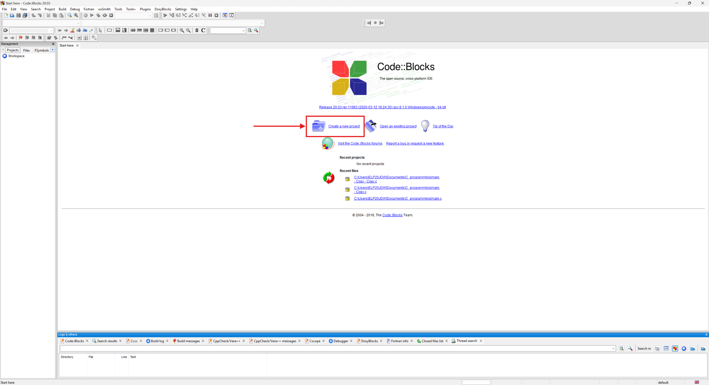
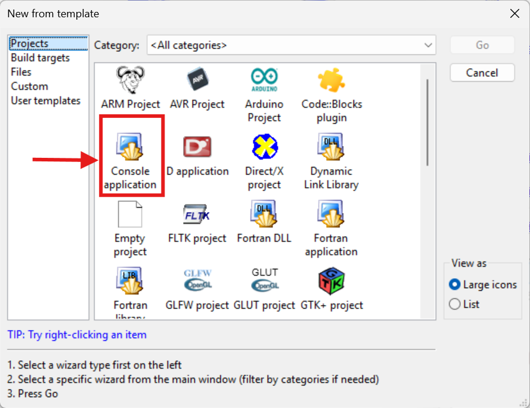
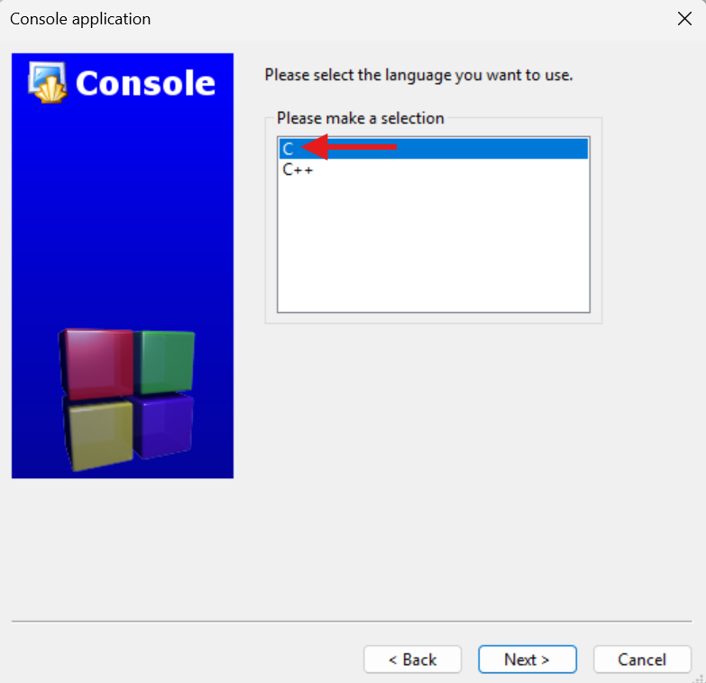
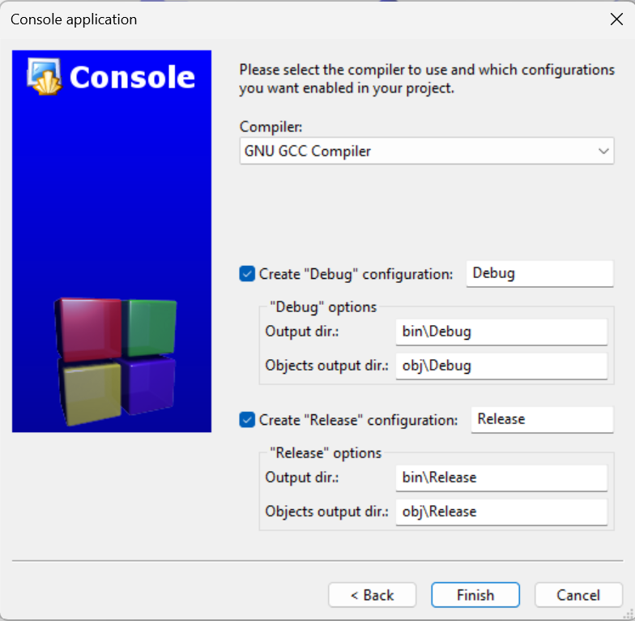
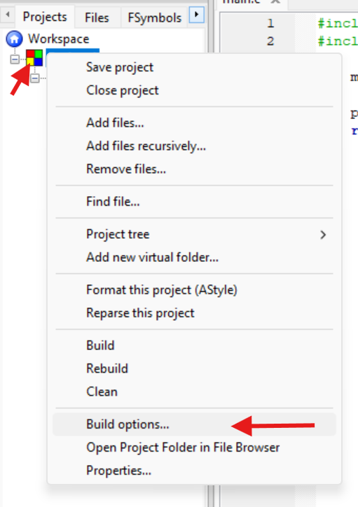
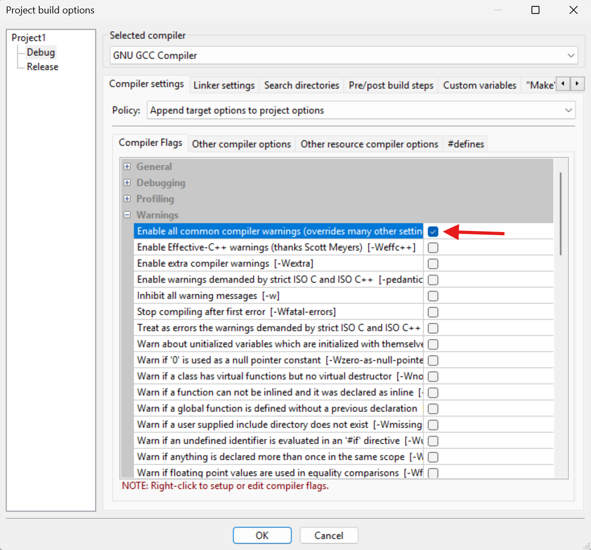
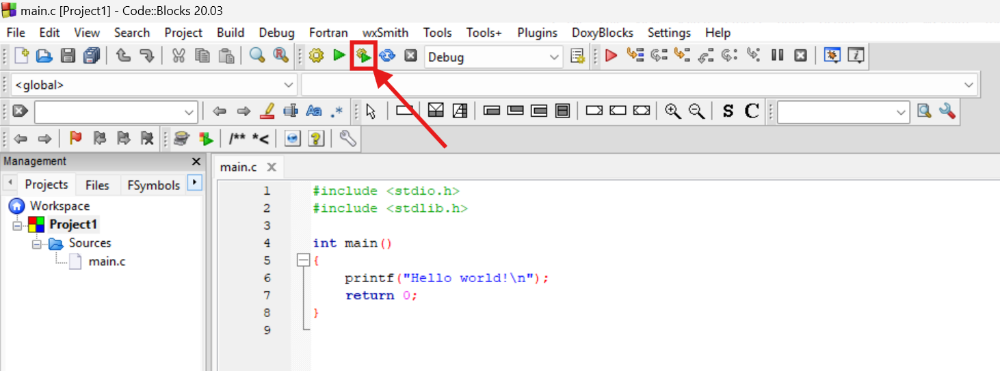
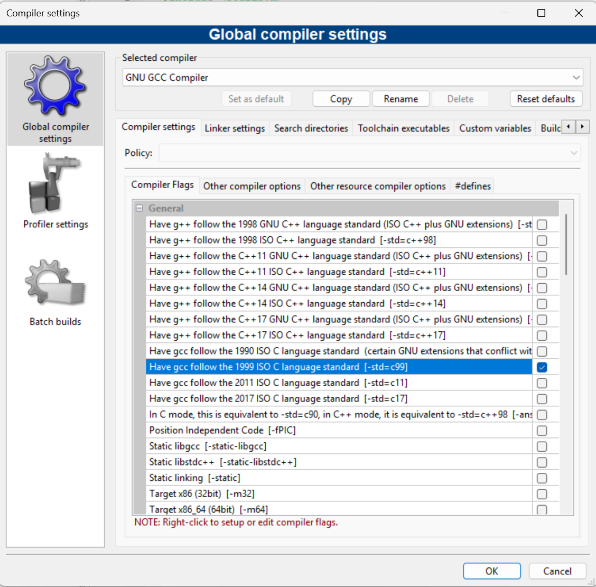

---
hide:
  - navigation # Hides the left navigation sidebar
  - toc        # Hides the right Table of Contents
lightbox: true
---

# Codeblocks Setup

## Installing Code::Blocks

=== "Managed Desktop"

    Code::Blocks is available on the managed PC software library; IDE and MinGW (GCC compiler for Windows) installed. In the Computer lab for the module, the software will be installed, in other locations you need to use the “Software Center” (icon on desktop) and search for the program to install.

=== "Personal Computer"

    • Go to http://www.codeblocks.org/downloads

    • Click on ‘Download the binary release’

    • Scroll to the ‘Microsoft Windows' section

    • Select codeblocks-xx.xxmingw-setup.exe and click on Sourceforge.net (this should automatically start the download). NOTE: xx.xx is just whatever the current version number is.

    • Click ‘Run’ (at the bottom of the screen)

    • Install the Codeblocks application using the install wizard (you might need to minimise the web browser)

    • After you have finished installing, click ‘Yes’ for Do you want to run Codeblocks now?

    • Click ‘GNU GCC Compiler, then click ‘OK’

## Quickstart

=== "Step 1"
    { width="800" }

    Open Code::Blocks on your computer, and select "Create a new project" (or existing)
=== "Step 2"
    { width="400" }

    Select console application
=== "Step 3"
    { width="400" }

    In the wizard setup, ensure you select cm and continue
=== "Step 4"
    { width="400" }

    The compiler should be set up automatically like this, but double check
=== "Step 5"
    { width="400" }

    On the left side of your screen, right click the project, and select "Build options..."
=== "Step 6"
    { width="400" }

    Scroll down to warnings, and ensure "Enable all common compiler warnings (overrides many other settings)" is enabled. click OK

    Flags determine how the compiler behaves, these are set though the IDE GUI (you’ll see this in a ‘make’ file later in course ).

=== "Step 7"
    { width="800" }

    Open main.c, and click "Build and Run" shown. this should compile your code and run it in a terminal.

## Compiler settings
In "Settings" -> "Compiler", make sure the the compiler follows the [-std=c99] standard. This will be important to ensure your code runs the same as everyone elses. 

{ width="400" }

## Debugging and Error Messages

Debugging is the process of removing errors from the code written. Errors can be compiling issues, ie big red text, or mistakes in the code due to the operator (you).

Luckily, Code::Blocks has multiple techniques to bugfix:

### Setting Up Your Project for Debugging
Before you can debug, you must have a project. If you're working with a single C file, create a new "Console application" project and add your file to it.

•	Go to File > New > Project...

•	Select Console application, and click Go.

•	Choose C as the language.

•	Give your project a name and save it.

•	Add your C source file to the project.

### Setting Breakpoints
A breakpoint is a marker you place on a line of code where you want the program execution to pause. This allows you to inspect the program's state at that specific point.

•	Open your C source file in the editor.

•	Click in the gray margin to the left of the line number where you want to set a breakpoint. A red circle will appear, indicating the breakpoint is active.

### Starting the Debugger
Once you have your breakpoints set, you can start the debugging session.

•	Go to Debug > Start/Continue.

•	Alternatively, you can press the F9 key.

The program will run until it hits the first breakpoint, and the line will be highlighted.

### Stepping Through Code
While the program is paused at a breakpoint, you can use these commands to control its execution:

•	F7 (Next line): Executes the current line of code and moves to the next one. This is the most common command for stepping through your program.

•	F8 (Next instruction): Similar to F7 but is more detailed, sometimes stepping into assembly instructions. Use F7 for most cases.

•	F4 (Next line of code - skip functions): Skips over function calls, executing the entire function and stopping on the line after it returns. Use this to avoid stepping through functions you know are correct.

### Watching Variables
One of the most powerful features of a debugger is the ability to inspect the values of variables in real-time.

•	Go to Debug > Debugging Windows > Watches.

•	In the "Watches" window that appears, you can see the values of variables as you step through the code.

•	You can add a variable to the watch list by right-clicking it in the editor and selecting "Add watch" or by manually typing its name in the "Watches" window.

## Common C Error Messages and How to Interpret Them

  
<code>expected ';' before 'token'</code>

   
  
<strong>Meaning:</strong> The compiler expects a semicolon at a certain point but found something else instead.

  
<strong>Common Causes:</strong>

  <ul>
    <li>Forgetting a semicolon at the end of a statement.</li>
    <li>This error can sometimes appear on the line <em>after</em> the actual error, as the compiler doesn't realize the semicolon is missing until it sees the next line of code.</li>
  </ul>
   

  
<code>conflicting types for 'variable_name'</code>

   
  
<strong>Meaning:</strong> You have declared the same variable or function with two different data types.

  
<strong>Common Causes:</strong>

  <ul>
    <li>Declaring a global variable with one type and then a local variable in a function with the same name and a different type.</li>
    <li>Declaring a function prototype with one return type but defining the function with another.</li>
  </ul>
   

  
<code>'variable_name' undeclared (first use in this function)</code>

   
  
<strong>Meaning:</strong> The compiler has no record of the variable you are trying to use.

  
<strong>Common Causes:</strong>

  <ul>
    <li>Forgetting to declare the variable before using it.</li>
    <li>Misspelling the variable name. C is case-sensitive, so <code>myVar</code> and <code>myvar</code> are treated as different variables.</li>
  </ul>
   

  
<code>warning: format '%d' expects type 'int *', but argument '2' has type 'int'</code>

   
  
<strong>Meaning:</strong> You are using the wrong format specifier in a function like <code>scanf</code> or <code>printf</code>. This specific message means you passed an <code>int</code> instead of a pointer to an <code>int</code> to <code>scanf</code>.

  
<strong>Common Causes:</strong>

  <ul>
    <li>Using <code>scanf("%d", num);</code> instead of the correct <code>scanf("%d", &amp;num);</code>. The <code>&amp;</code> operator passes the variable address so <code>scanf</code> can store the value.</li>
    <li>Using the wrong format specifier, e.g., <code>%f</code> for a <code>double</code> instead of <code>%lf</code>.</li>
  </ul>
   

  
<code>undefined reference to 'function_name'</code>

   
  
<strong>Meaning:</strong> The linker cannot find the implementation/definition for a function that you called.

  
<strong>Common Causes:</strong>

  <ul>
    <li>Forgetting to include a library header file (e.g., <code>&lt;string.h&gt;</code> for <code>strlen()</code>).</li>
    <li>Misspelling the function name in the code or header.</li>
    <li>Trying to use a function from an external library that has not been properly linked during compilation.</li>
  </ul>
   

